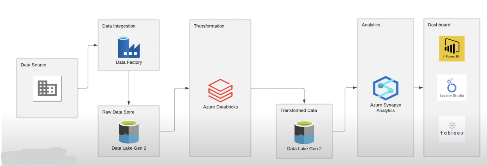
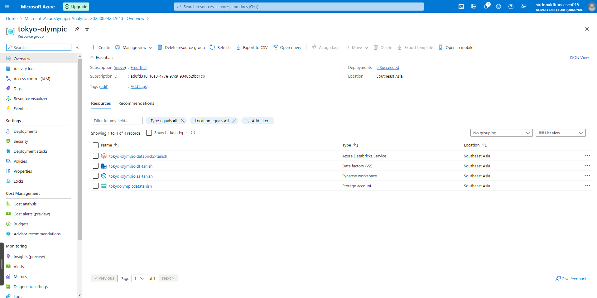
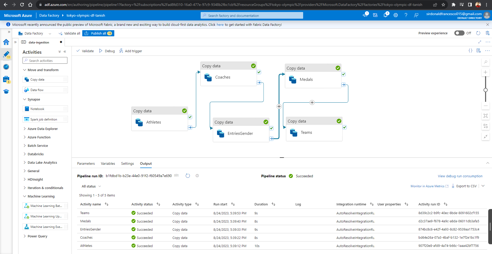
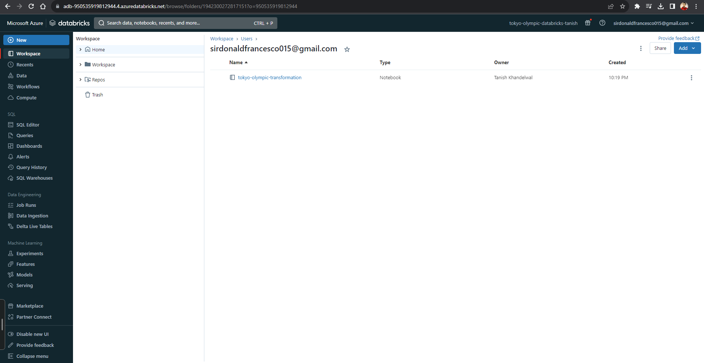

# Olympic Data Analysis on Azure

The **Tokyo Olympic Data Analysis on Azure** project demonstrates an end-to-end, cloud-based data engineering and analytics pipeline using Microsoft Azure services. This project showcases how to ingest, process, transform, and visualize large-scale Olympic Games data in a scalable and production-ready manner.

It is designed to highlight real-world data engineering practices using Azure-native tools such as Azure Data Factory, Azure Databricks, and Azure SQL, making it suitable for portfolio and resume purposes.

---

## Table of Contents
- [Introduction](#introduction)
- [Architecture](#architecture)
- [Technologies Used](#technologies-used)
- [Getting Started](#getting-started)
  - [Prerequisites](#prerequisites)
- [Data Ingestion](#data-ingestion)
- [Data Processing](#data-processing)
- [Conclusion](#conclusion)

---

## Introduction

The Olympic Data Analysis on Azure project focuses on building a robust data pipeline to analyze historical Olympic data. The solution includes automated data ingestion, distributed data processing, structured data storage, and business intelligence reporting.

This project serves as a reference architecture for modern data engineering workflows on Azure and can be extended to other analytical use cases beyond sports data.

---

## Architecture

The high-level architecture includes the following components:

- **Azure Data Factory**  
  Orchestrates the data pipeline, handling ingestion, scheduling, and workflow automation.

- **Azure Databricks**  
  Performs scalable data processing and transformation using Apache Spark.

- **Azure Storage (Data Lake)**  
  Acts as the central storage layer for raw, processed, and curated datasets.

- **Azure SQL Database**  
  Stores cleaned and structured data for analytics and reporting.

- **Power BI**  
  Consumes data from Azure SQL Database to create interactive dashboards and reports.

---

## Technologies Used

- Azure Data Factory
- Azure Databricks (Apache Spark)
- Azure Data Lake Storage
- Azure SQL Database
- Azure Synapse Analytics
- Power BI

---

## Getting Started

### Prerequisites

- An active Azure subscription
- Azure Data Factory instance
- Azure Databricks workspace
- Basic knowledge of data engineering and Azure services

---

## Data Ingestion

Raw Olympic datasets are ingested into Azure Data Lake using Azure Data Factory pipelines. The ingestion layer is designed to be modular and easily extensible for additional data sources.

---

## Data Processing

Azure Databricks is used to clean, transform, and enrich the ingested data. Spark-based processing enables efficient handling of large datasets, ensuring high performance and scalability.

Processed data is then stored in a structured format for downstream analytics.

---

## Conclusion

This project demonstrates how Azure services can be combined to build a reliable and scalable data analytics pipeline. It reflects real-world data engineering patterns such as orchestration, distributed processing, and BI integration.

The architecture and implementation can be adapted for other domains like finance, healthcare, or IoT analytics.

---

## Author
**Rajakashyap77**  
GitHub: https://github.com/rajakashyap77
